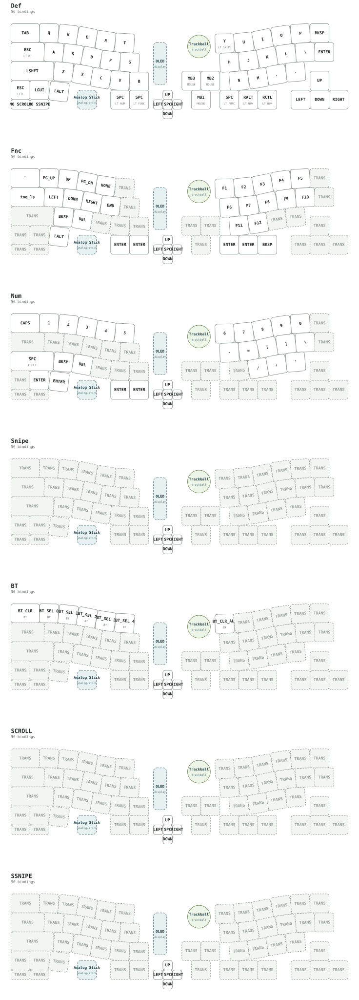

# GeaconPolaris

[](https://github.com/te9no/zmk-config-GeaconPolaris/actions/workflows/build.yml?query=branch%3Amain)

> [!IMPORTANT]
> `codex/zmk-0.4-esb-validation` is an opt-in ESB experiment, not a release.
> Use only `Polaris_L_JOY_ESB_USB` and `Polaris_R_TB_ESB` on this branch.
> The ESB radio link is **not encrypted or authenticated: do not type secrets**.
> BLE and remote Studio sensor RPC are unavailable; the left uses the standard OLED.
> [Trial instructions, build evidence and limitations](docs/esb-validation.md).
>
> ESB専用試験ブランチです。通常のBLE版は元のブランチ／profileでビルドしてください。

**GeaconPolaris is not merely a keyboard. It is a split navigation instrument.**

Built on [ZMK Firmware](https://zmk.dev/), Polaris brings typing, pointing,
scrolling, and hardware experimentation into one modular ergonomic device.
Stable left and right base shields form the platform. Trackballs, touchpads,
encoders, analog controls, and an IQS9151 module define the route from there.

Polaris is the North Star of the Geacon lineage: a practical keyboard, a
platform for experimenting with pointing devices, and a record of how those
experiments become maintainable firmware.



## Features

- ZMK split keyboard targeting `xiao_ble//zmk`.
- Stable `Polaris_L_Base` and `Polaris_R_Base` shields.
- Input hardware selected with function-oriented ZMK Snippets.
- Five left-side routes: LPPS, trackball, joystick, encoder, and touchpad.
- Three right-side routes: trackball, touchpad, and IQS9151.
- Seven layers: `DEF`, `FUNC`, `NUM`, `SNIPE`, `BT`, `SCROLL`, and `SSNIPE`.
- Runtime combo and macro support for DYA Studio.
- Device information, watchdog, key-switch, PMW3610, and stack-usage diagnostics.
- Portrait OLED with both battery levels, layer, Bluetooth profile and status.
- Local and GitHub Actions builds driven by the same `build.yaml`.

## Modular Input System

The base shields describe the keyboard. Snippets describe the module attached
to each side. This separates shared matrix, power, display, and split
configuration from module-specific buses and input listeners.

### Left-Hand Builds

All left builds use `Polaris_L_Base rgbled_adapter nice_oled`.

| Module | Snippets | Artifact |
| --- | --- | --- |
| LPPS analog stick | `LPPS studio-rpc-usb-uart cdc-boot` | `Polaris_L_MODULE_LPPS` |
| Trackball | `TB_L studio-rpc-usb-uart cdc-boot` | `Polaris_L_MODULE_TB` |
| Joystick | `JOY battery-voltage-divider-oversampling studio-rpc-usb-uart cdc-boot` | `Polaris_L_MODULE_JOY` |
| Rotary encoder | `ENC studio-rpc-usb-uart cdc-boot` | `Polaris_L_MODULE_ENC` |
| Touchpad | `TPD_L studio-rpc-usb-uart cdc-boot` | `Polaris_L_MODULE_TPD` |

### Right-Hand Builds

All right builds use `Polaris_R_Base rgbled_adapter`.

| Module | Snippets | Artifact |
| --- | --- | --- |
| Trackball | `TB_R zmk-usb-logging cdc-debug-boot` | `Polaris_R_MODULE_TB` |
| Touchpad | `TPD_R zmk-usb-logging cdc-debug-boot` | `Polaris_R_MODULE_TPD` |
| IQS9151 | `IQS zmk-usb-logging cdc-debug-boot` | `Polaris_R_MODULE_IQS` |

All normal right-hand artifacts expose CDC Debug and use that same CDC UART for
the 1200-baud bootloader trigger. No extra diagnostic artifact or USB CDC
endpoint is required.

`TB_L` / `TB_R` and `TPD_L` / `TPD_R` are deliberately separate. Their
local and split-input routes differ by side, and making that distinction
visible is safer than hiding it behind conditional Devicetree fragments.

> The physical replacement procedure and hot-swap safety still require
> dedicated hardware documentation. Do not assume modules are hot-swappable.

## Keymap

The source of truth is [`config/Polaris.keymap`](config/Polaris.keymap).

| Constant | Layer | Purpose |
| --- | --- | --- |
| `DEF` | `default_layer` | Main typing and access to other layers |
| `FUNC` | `function_layer` | Function keys, navigation, and layout shift |
| `NUM` | `num_layer` | Numbers, symbols, and editing/navigation keys |
| `SNIPE` | `snipe_layer` | Precision-oriented pointer controls |
| `BT` | `bt_layer` | Bluetooth profile selection and clearing |
| `SCROLL` | `scroll_layer` | Scroll-oriented sensor bindings |
| `SSNIPE` | `SSNIPE_layer` | Precision scroll/sensor bindings |

The keymap also defines language-switching combos and runtime sensor-rotate
behaviors. The generated SVG includes combo geometry.

## DYA Studio and Diagnostics

The ZMK 0.4-based DYA Studio stack is pinned in
[`config/west.yml`](config/west.yml). The firmware includes support for:

- runtime combos and macros;
- device and build information;
- watchdog and freeze history;
- key-switch diagnostics;
- PMW3610 diagnostics with split relay support;
- thread stack-usage diagnostics;
- runtime input-processor and module-specific RPC settings.

The normal firmware keeps these diagnostics available so a device can explain
its state without requiring a private debug build. All right-hand artifacts
also expose CDC Debug and the 1200-baud bootloader trigger.

## OLED

The left-side SSD1306 is physically mounted in portrait orientation. The
`nice_oled` module displays:

- central battery level;
- peripheral battery level;
- active layer;
- Bluetooth profile number and connection-state icon;
- a small animated cat in the remaining area.

## Build

[`build.yaml`](build.yaml) is the build matrix used locally and in CI.

### Local Build

From `zmk-workspace`, initialize this config and use `just.sh`:

```sh
./just.sh init config/zmk-config-GeaconPolaris
./just.sh build all
```

Build one target by artifact name:

```sh
./just.sh build Polaris_R_MODULE_IQS
```

Local output is written under `.build/<artifact-name>/zephyr/`.

### GitHub Actions and Firmware

[`.github/workflows/build.yml`](.github/workflows/build.yml) calls
`te9no/zmk-workspace/.github/workflows/build-zmk-firmware.yml@main`. It
creates the matrix, restores west/ccache data, builds up to four targets in
parallel, uploads artifacts, publishes UF2 files, and updates the health badge.

It runs on relevant pushes, manual dispatch, and daily at 05:00 JST. Manual
runs accept a target regex; use `all` for every target.

Firmware is available in two places:

1. The merged downloadable artifact on each successful Actions run.
2. Committed UF2 files under `firmware/<repository>/<sanitized-branch>/`.

For example, `codex/polaris-latest-dya-studio` is published to
`firmware/zmk-config-GeaconPolaris/codex-polaris-latest-dya-studio/`. Slash
characters in branch names become hyphens. The current public `main` output is
in [`firmware/zmk-config-GeaconPolaris/main/`](firmware/zmk-config-GeaconPolaris/main/).

## Repository Structure

| Path | Purpose |
| --- | --- |
| `config/Polaris.keymap` | Layers, combos, and behavior bindings |
| `config/west.yml` | Pinned ZMK and module revisions |
| `boards/shields/GeaconPolaris/Polaris.dtsi` | Shared include entry point |
| `boards/shields/GeaconPolaris/Polaris_hardware.dtsi` | Shared hardware nodes |
| `boards/shields/GeaconPolaris/Polaris_layout.dtsi` | Physical layout and matrix transform |
| `boards/shields/GeaconPolaris/Polaris_modules.dtsi` | Studio module metadata |
| `boards/shields/GeaconPolaris/Polaris_pins.dtsi` | Centralized pin assignments |
| `boards/shields/GeaconPolaris/Polaris_L_Base.overlay` | Left base, matrix, OLED, and I2C |
| `boards/shields/GeaconPolaris/Polaris_R_Base.overlay` | Right base and split offset |
| `snippets/` | Module, logging, reset, and bootloader Snippets |
| `keymap-svg/Polaris.svg` | Generated physical-layout keymap |
| `build.yaml` | Firmware build matrix |
| `firmware/` | CI firmware grouped by repository and branch |

## Philosophy

A conventional keyboard config asks which key sends which code. Polaris asks a
larger question: how many forms of input can a split ergonomic device support
without turning its firmware into an opaque collection of special cases?

The answer is implementation: stable base shields, explicit module Snippets,
centralized pin definitions, pinned dependencies, visible build routes,
diagnostics, and generated documentation. The mythology works only because the
code carries it.

## Documentation TODO

- Physical module mounting and replacement procedure.
- Electrical hot-swap safety.
- Battery, charging, and expected runtime details.
- User-facing examples for `layout_shift.dtsi` and each precision layer.
- Hardware photographs for each module route.

## License

See [`LICENSE`](LICENSE).

---

# GeaconPolaris 日本語版

**GeaconPolaris は、単なるキーボードではありません。分割された航法装置です。**

ZMK を土台に、文字入力、ポインティング、スクロール、入力モジュールの
実験を、ひとつの分割エルゴノミクスデバイスにまとめています。左右の
base shield を安定した土台とし、その上にトラックボール、タッチパッド、
エンコーダー、アナログ入力、IQS9151 を Snippet として重ねます。

Polaris は Geacon 系譜の北極星です。実用できるキーボードであり、入力
デバイスの実験場であり、実験を保守可能な firmware に変えるための到達点
でもあります。

## 特徴

- `xiao_ble//zmk` を対象にした ZMK 分割キーボード。
- `Polaris_L_Base` / `Polaris_R_Base` を共通の土台として使用。
- 入力モジュールを機能単位の Snippet として分離。
- 左側は LPPS、トラックボール、ジョイスティック、エンコーダー、
  タッチパッドに対応。
- 右側はトラックボール、タッチパッド、IQS9151 に対応。
- `DEF`, `FUNC`, `NUM`, `SNIPE`, `BT`, `SCROLL`, `SSNIPE` の 7 レイヤー。
- DYA Studio の runtime combo / macro と各種診断機能に対応。
- 左側の縦置き OLED に左右バッテリー、レイヤー、Bluetooth profile と
  接続状態、アニメーションを表示。

## モジュール構成

### 左側

| モジュール | Snippet | Artifact |
| --- | --- | --- |
| LPPS アナログスティック | `LPPS studio-rpc-usb-uart cdc-boot` | `Polaris_L_MODULE_LPPS` |
| トラックボール | `TB_L studio-rpc-usb-uart cdc-boot` | `Polaris_L_MODULE_TB` |
| ジョイスティック | `JOY battery-voltage-divider-oversampling studio-rpc-usb-uart cdc-boot` | `Polaris_L_MODULE_JOY` |
| ロータリーエンコーダー | `ENC studio-rpc-usb-uart cdc-boot` | `Polaris_L_MODULE_ENC` |
| タッチパッド | `TPD_L studio-rpc-usb-uart cdc-boot` | `Polaris_L_MODULE_TPD` |

左側はすべて `Polaris_L_Base rgbled_adapter nice_oled` を使用します。

### 右側

| モジュール | Snippet | Artifact |
| --- | --- | --- |
| トラックボール | `TB_R zmk-usb-logging cdc-debug-boot` | `Polaris_R_MODULE_TB` |
| タッチパッド | `TPD_R zmk-usb-logging cdc-debug-boot` | `Polaris_R_MODULE_TPD` |
| IQS9151 | `IQS zmk-usb-logging cdc-debug-boot` | `Polaris_R_MODULE_IQS` |

右側はすべて `Polaris_R_Base rgbled_adapter` を使用します。通常artifactは
すべてCDC Debugを公開し、同じCDC UARTを1200 baud boot triggerにも使用する
ため、専用の診断artifactや追加USB CDC endpointは不要です。

左右の TB / TPD Snippet は意図的に分けています。Devicetree と split-input
の経路が左右で異なるため、条件分岐の中に隠すより build route として
見える方が安全だからです。

## キーマップ

キーマップの正本は [`config/Polaris.keymap`](config/Polaris.keymap) です。

| 定数 | レイヤー | 役割 |
| --- | --- | --- |
| `DEF` | `default_layer` | 通常入力と各レイヤーへの入口 |
| `FUNC` | `function_layer` | Function key、navigation、layout shift |
| `NUM` | `num_layer` | 数字、記号、編集・移動キー |
| `SNIPE` | `snipe_layer` | 精密なポインター操作 |
| `BT` | `bt_layer` | Bluetooth profile の選択・消去 |
| `SCROLL` | `scroll_layer` | スクロール用 sensor binding |
| `SSNIPE` | `SSNIPE_layer` | 精密スクロール用 sensor binding |

言語切替 combo と runtime sensor rotate behavior もここで定義しています。

## DYA Studio と診断

[`config/west.yml`](config/west.yml) には ZMK 0.4 系の DYA Studio 構成を
commit SHA で固定しています。firmware は次の診断機能を含みます。

- device/build information;
- watchdog と freeze history;
- key-switch diagnostics;
- split relay を含む PMW3610 diagnostics;
- thread stack usage;
- runtime input processor とモジュール固有 RPC。

IQS の詳細 serial log だけは負荷を分離するため `_DEBUG` artifact に
限定しています。

## OLED

左側の SSD1306 は物理的に縦向きです。表示内容は次のとおりです。

- Central と Peripheral のバッテリー残量。
- 現在のレイヤー。
- Bluetooth profile 番号と接続状態アイコン。
- 空き領域の小さな猫アニメーション。

## ビルド

`zmk-workspace` から `just.sh` を使用します。

```sh
./just.sh init config/zmk-config-GeaconPolaris
./just.sh build all
```

個別ビルドは artifact 名を指定します。

```sh
./just.sh build Polaris_R_MODULE_IQS
```

GitHub Actions は対象ファイルの push、手動実行、毎日 05:00 JST に動作し、
最大 4 並列で build します。

firmware の入手方法は 2 通りあります。

1. 成功した Actions run から統合 artifact をダウンロードする。
2. `firmware/<repository>/<sanitized-branch>/` の UF2 を使う。

`codex/polaris-latest-dya-studio` の成果物は
`firmware/zmk-config-GeaconPolaris/codex-polaris-latest-dya-studio/` に
置かれます。branch 名の `/` は `-` に変換されます。`main` の成果物は
[`firmware/zmk-config-GeaconPolaris/main/`](firmware/zmk-config-GeaconPolaris/main/)
です。

## 設計思想

一般的な keyboard config は「どのキーがどの code を送るか」を扱います。
Polaris が扱うのは、分割入力装置がどれだけ異なる入力形態を受け入れながら、
firmware を特殊処理の塊にせず保てるか、という問題です。

答えは実装として残しています。安定した base shield、明示的な Snippet、
集約した pin 定義、固定した依存 revision、見える build route、診断機能、
生成ドキュメントです。世界観は、実装が支える範囲にだけ置いています。

## 未整備のドキュメント

- モジュールの物理的な取り付け・交換手順。
- 通電中の交換可否。
- バッテリー、充電、想定稼働時間。
- `layout_shift.dtsi` と各 precision layer の利用例。
- 各モジュール構成の写真。

## License

[`LICENSE`](LICENSE) を参照してください。
